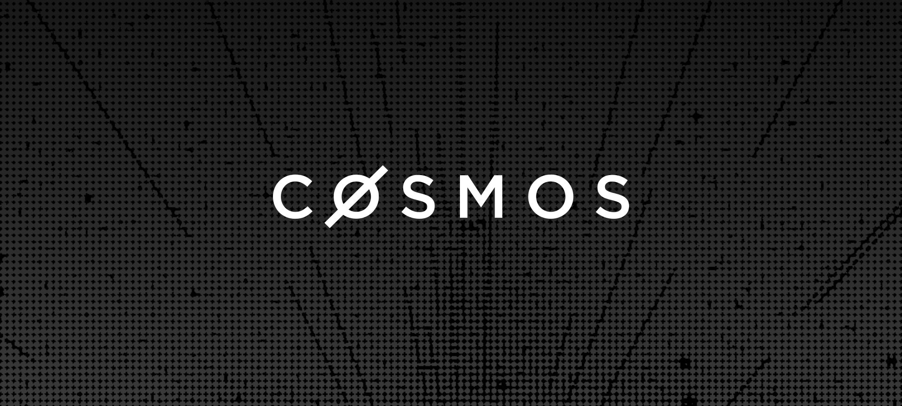

  <h1> Cosmos Stack </h1>

The Cosmos Stack is the most widely-adopted and battle-tested Layer 1 blockchain technology stack, in production with 200+ chains today. It is performant, customizable, and EVM-compatible, offering engineers full end-to-end control of their blockchain infrastructure and implementation. 

The Stack is modular by design; use pre-built code modules or integrate custom features and logic for your use case, compliance needs, governance, consensus, and performance requirements. The Cosmos Stack is open-source.

The Cosmos Stack's primary components include:
- **CometBFT**, a low-latency, fast finality, and high throughput consensus engine
- **Cosmos SDK**, a modular SDK for building secure, high-performance, application-specific blockchains
- **Cosmos EVM**, a production-ready EVM layer with full compatibility with Ethereum smart contracts and tooling
- **Inter-Blockchain Communication Protocol (IBC)**, the secure, industry-standard blockchain messaging protocol that enables cross-chain communication without the use of a third-party intermediary.

| Need Help? | Support & Community: [Discord](https://discord.com/invite/interchain) - [Telegram](https://t.me/CosmosOG) - [Talk to an Expert](https://cosmos.network/interest-form) - [Join the #Cosmos-tech Slack Channel](https://forms.gle/A8jawLgB8zuL1FN36) |
| :--------: | :-----------------------------------------------------------------------------------------------------------------------------------------------------------------------------------------: |

## Cosmos Stack Components

| Cosmos SDK | CometBFT | IBC | Cosmos EVM | Testing | Chain Info | Frontend | CosmWasm\* |
| :--: | :--: | :--: | :--: | :--: | :--: | :--: | :--: |
| Blockchain SDK | Battle-Tested Consensus | Inter-Blockchain Communication Protocol | Native EVM Compatibility | Utilities & Frameworks | Registries & Tools | TS Tooling & Utilities | Rust Smart Contracts |
| **[docs](https://docs.cosmos.network/)** | **[docs](https://docs.cometbft.com/)** | **[docs](https://ibc.cosmos.network/)** | **[docs](https://evm.cosmos.network)** |  |  |  | **[docs](https://docs.cosmwasm.com/docs/)** |
| [Cosmos SDK](https://github.com/cosmos/cosmos-sdk) | [CometBFT](https://github.com/cometbft/cometbft) | [Eureka](https://docs.skip.build/go/eureka/eureka-overview#what-is-ibc-eureka) | [Cosmos EVM](https://github.com/cosmos/evm) | [MultiTest](https://github.com/CosmWasm/MultiTest)\* | [Chain Registry](https://github.com/cosmos/chain-registry)\* | [Create Interchain App](https://github.com/hyperweb-io/create-interchain-app)\* | [CosmWasm](https://github.com/CosmWasm/cosmwasm)\* |
| [Ignite CLI](https://github.com/ignite/cli)\* | [CometBFT DB](https://github.com/cometbft/cometbft-db) | [ibc-go](https://github.com/cosmos/ibc-go) |  | [Interchain Test](https://github.com/cosmos/interchaintest) | [Client](https://www.npmjs.com/package/@chain-registry/client)\* | [Interchain Kit](https://github.com/hyperweb-io/interchain-kit)\* | [TS Codegen](https://github.com/CosmWasm/ts-codegen)\* |
| [Spawn CLI](https://github.com/rollchains/spawn)\* |  |  [Hermes Relayer](https://hermes.informal.systems/)\* |  | [Starship](https://github.com/cosmology-tech/starship)\* | [npm Module](https://www.npmjs.com/package/chain-registry)\* | [Interchain UI](https://github.com/cosmology-tech/interchain-ui)\* | [Wasmd](https://github.com/CosmWasm/wasmd)\* |
|  |  | [ibc-rs](https://github.com/cosmos/ibc-rs)\* |  |  | [Rust Crate](https://crates.io/crates/chain-registry)\* | [InterchainJS](https://github.com/hyperweb-io/interchainjs)\* | [Cosmwasm Optimizer Crate](https://github.com/CosmWasm/optimizer)\* |
|  |  |  |  |  | [Utilities](https://www.npmjs.com/package/@chain-registry/utils)\* | [Telescope](https://github.com/cosmology-tech/telescope)\* |  |

> **Note:** Projects marked with an asterisk (\*) are community or third-party maintained. They are not directly maintained by Cosmos Labs.

## Maintainers and Contributors
[Cosmos Labs](https://cosmoslabs.io/) maintains the core components of the stack: Cosmos SDK, CometBFT, IBC, Cosmos EVM, and various developer tools and frameworks. In addition to developing and maintaining the Cosmos Stack, Cosmos Labs provides advisory and engineering services for blockchain solutions. [Get in touch with Cosmos Labs](https://www.cosmoslabs.io/contact).

Cosmos Labs is a wholly-owned subsidiary of the [Interchain Foundation](https://interchain.io/), the Swiss nonprofit responsible for treasury management, funding public goods, and supporting governance for Cosmos. 

The Cosmos Stack is supported by a robust community of open-source contributors. 

## Security
Read about updates and security processes in the [Security repo](https://github.com/interchainio/security). 

#### Explore the [Cosmos Network](https://cosmos.network/) to learn more about the Cosmos technology stack and use cases.
